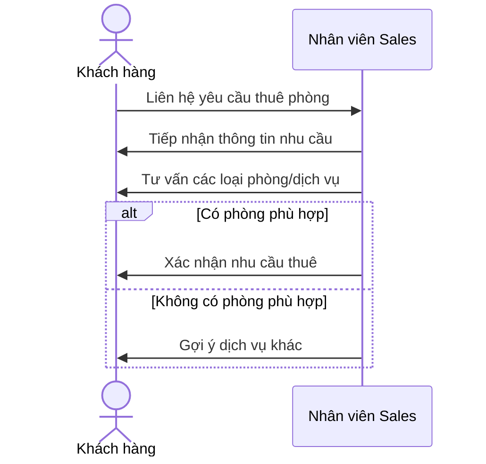
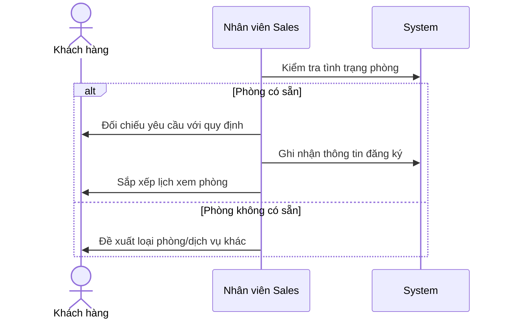
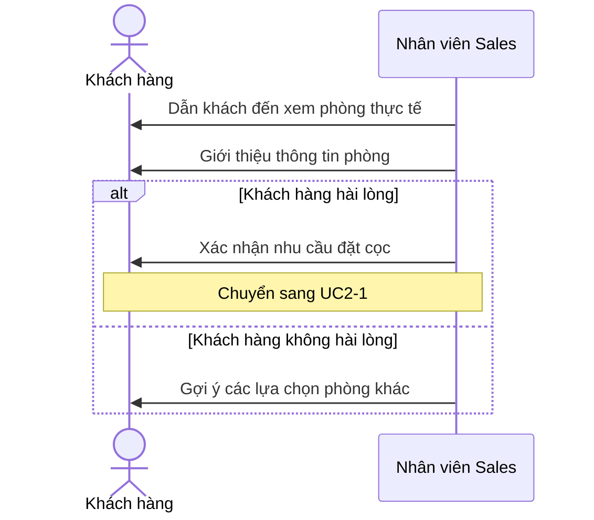

# UC1 — Tư vấn & Tiếp nhận yêu cầu (Inquiry & Consultation)

## Overview

| | |
| --- | --- |
| Actor | Khách hàng (Customer) |
| Goal | Receive rental inquiry, advise customer, schedule room visit |
| Triggers | Customer contacts Sales |
| Outcome | Room visit scheduled → leads to UC2 |

## UC1-1: Tiếp nhận yêu cầu

## UC1-2: Ghi nhận đăng ký & sắp xếp lịch xem phòng

## UC1-3: Xem phòng

