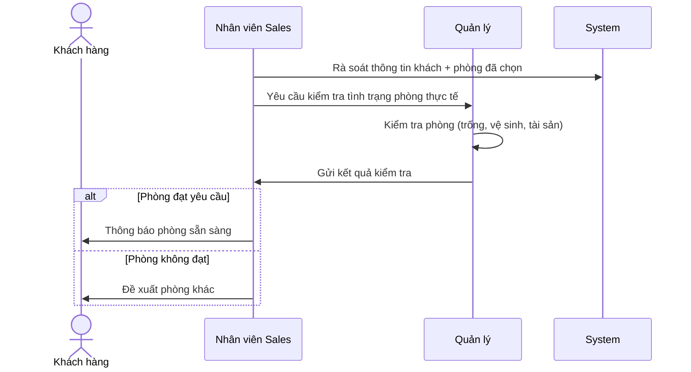
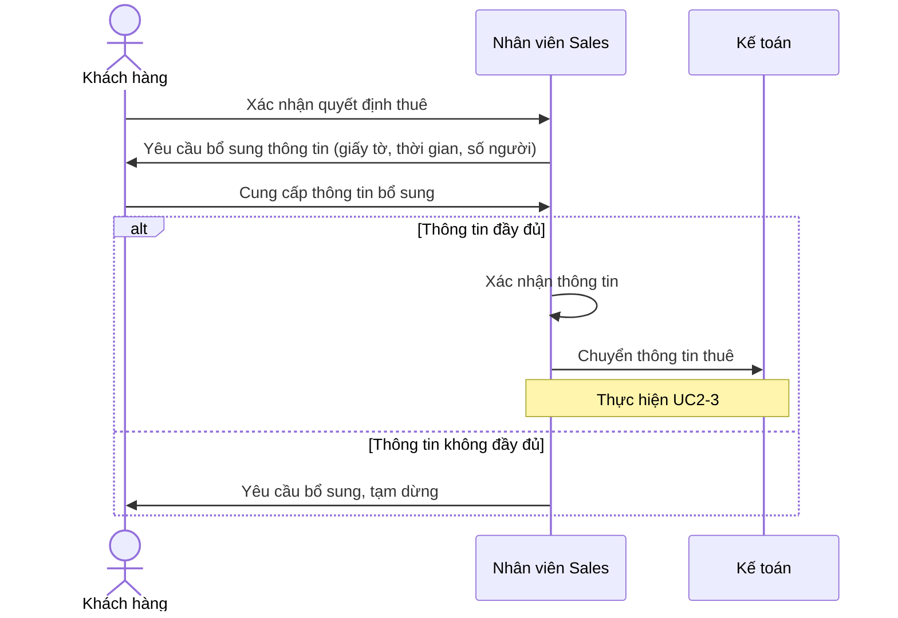
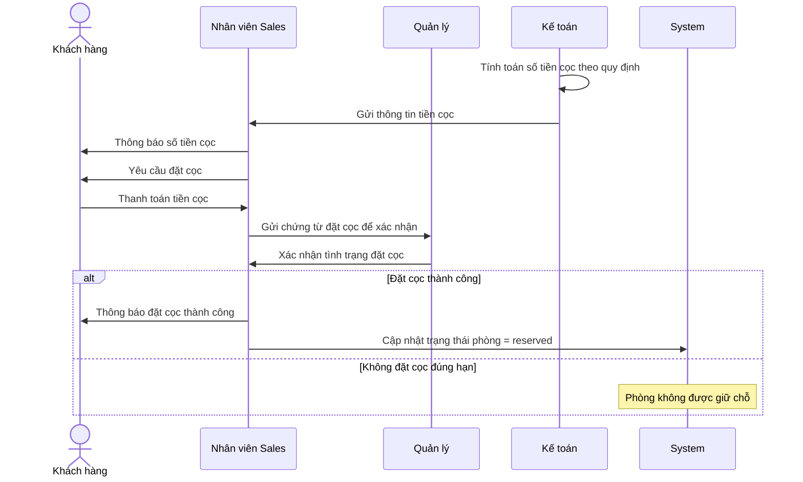

# UC2 — Đặt cọc & Xác nhận thuê (Deposit & Rental Confirmation)

## Overview

| | |
| --- | --- |
| Actor | Khách hàng (Customer) |
| Goal | Confirm room availability, collect documents, receive deposit |
| Triggers | UC1-3 (customer confirms intent to deposit) |
| Outcome | Room reserved in system → leads to UC3 |

## UC2-1: Xác nhận tình trạng phòng (Include)

## UC2-2: Xác nhận nhu cầu thuê (Extends UC2)

## UC2-3: Xác nhận đặt cọc (Extends UC2)

