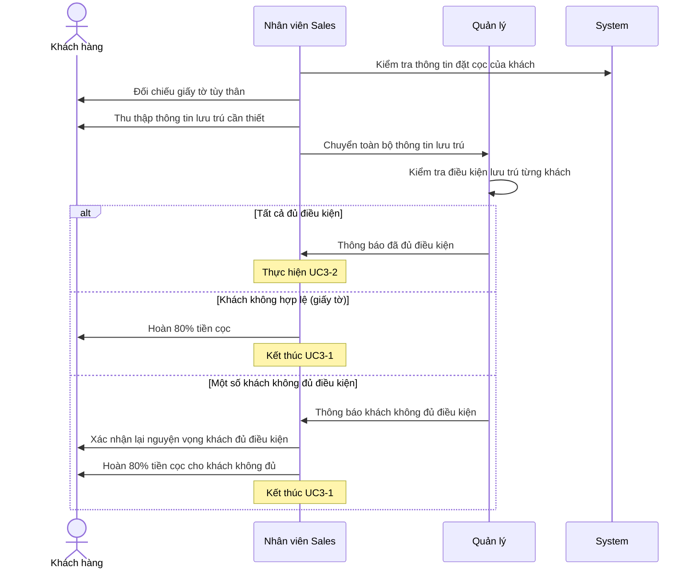
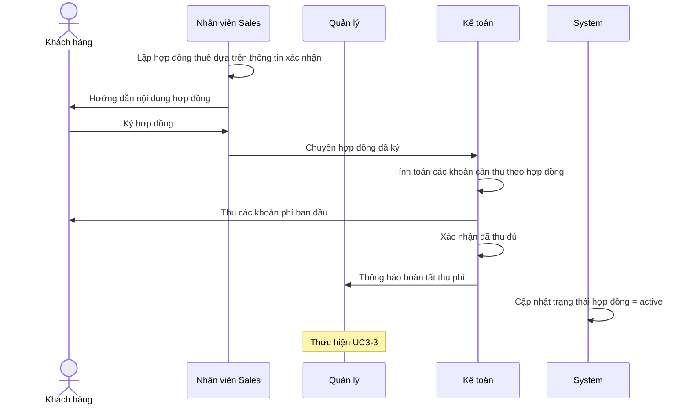
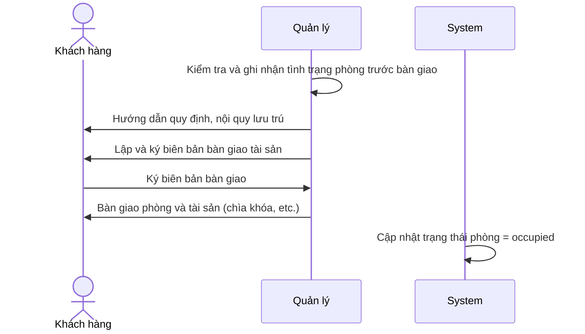

# UC3 — Nhận phòng, Ký hợp đồng & Bàn giao (Check-in)

## Overview

| | |
| --- | --- |
| Actor | Khách hàng (Customer) |
| Goal | Verify lodging conditions, sign contract, hand over room |
| Triggers | UC2-3 deposit confirmed |
| Outcome | Contract active, room status = occupied |

## UC3-1: Kiểm tra điều kiện lưu trú (Include)

## UC3-2: Lập hợp đồng

## UC3-3: Nhận phòng

