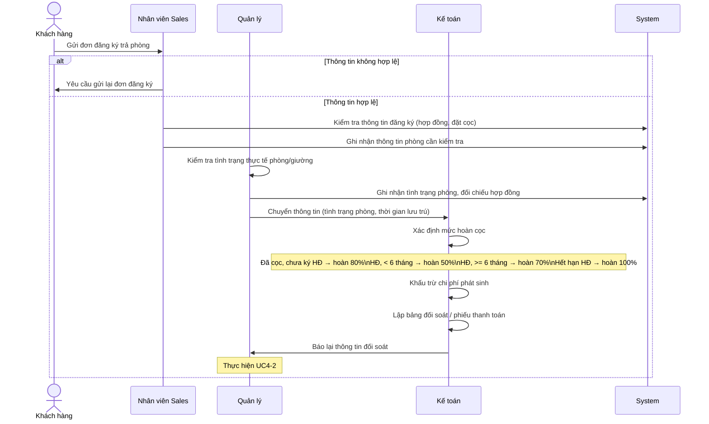
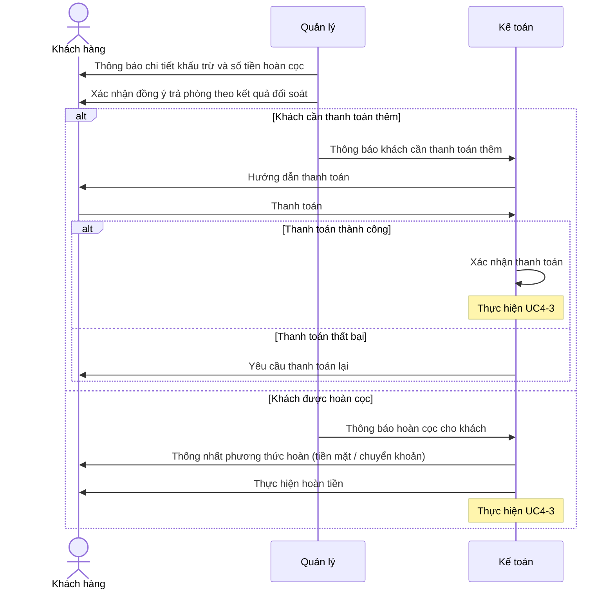
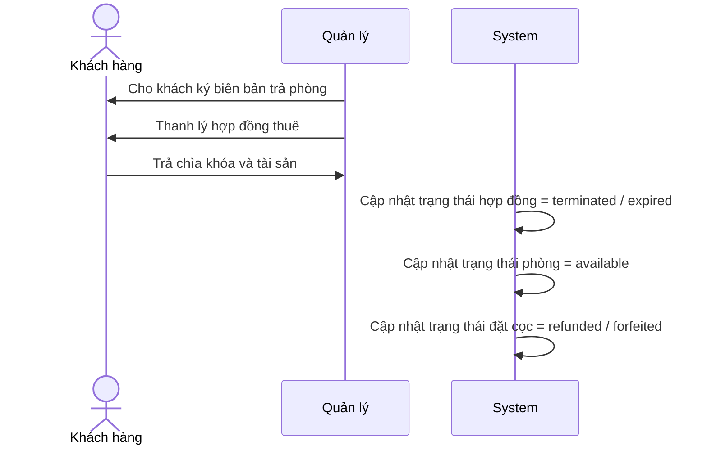

# UC4 — Trả phòng (Check-out)

## Overview

| | |
| --- | --- |
| Actor | Khách hàng (Customer) |
| Goal | Process check-out request, reconcile payments, hand back room |
| Triggers | Customer submits check-out request |
| Outcome | Contract terminated, deposit refunded or charged, room = available |

## UC4-1: Xử lý đơn đăng ký trả phòng

## UC4-2: Xác nhận đối soát & thanh toán

## UC4-3: Trả phòng

