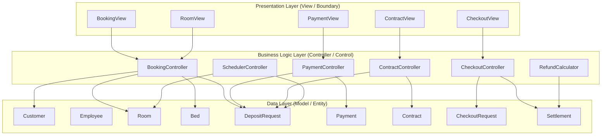

# Architecture Layers

## Overview

The system follows 3 complementary patterns: **3-Layer Architecture** (deployment), **MVC** (processing organization), and **BCE (Boundary-Control-Entity)** (analysis model).



---

## Presentation Layer — `<<boundary>>`

| Class | Responsibility |
| --- | --- |
| `BookingView` | Room search, deposit request UI |
| `PaymentView` | Payment confirmation UI |
| `ContractView` | Contract display and signing UI |
| `CheckoutView` | Check-out request and settlement UI |
| `RoomView` | Room listing and detail UI |

**Rules:**
- No business logic
- No direct data access
- Only calls Controller methods
- Only displays data received from Controller

---

## Business Logic Layer — `<<control>>`

| Class | Responsibility |
| --- | --- |
| `BookingController` | Validates room availability, creates DepositRequest, sets Room = HOLDING |
| `PaymentController` | Confirms payment, updates DepositRequest = PAID, Room = DEPOSITED |
| `ContractController` | Checks lodging conditions (UC3-1), creates Contract, handles 80% refund on fail |
| `CheckoutController` | Receives CheckoutRequest (UC4-1), triggers Settlement calculation |
| `RefundCalculator` | Applies refund rules (50/70/80/100%) and deductions to produce Settlement |
| `SchedulerController` | Runs on schedule; expires PENDING DepositRequests older than 24h; resets Room = AVAILABLE |

**Rules:**
- All business logic lives here
- Receives calls from View layer only
- Reads/writes Entity layer only
- No direct HTTP or DB calls (delegated to service/repository)

---

## Data Layer — `<<entity>>`

| Class | Key fields |
| --- | --- |
| `Customer` | id, email, full_name, phone, identity_number |
| `Employee` | id, email, full_name, role (sales, manager, accountant) |
| `Room` | id, branch_id, room_number, room_type, capacity, price, **status** |
| `Bed` | id, room_id, bed_number, status |
| `DepositRequest` | id, customer_id, room_id, amount, **status**, expires_at |
| `Payment` | id, deposit_request_id, contract_id, amount, type, payment_method |
| `Contract` | id, customer_id, room_id, start_date, end_date, monthly_rent, **status** |
| `CheckoutRequest` | id, contract_id, customer_id, requested_at, **status** |
| `Settlement` | id, checkout_request_id, deposit_refund_amount, deductions, net_amount |

**Rules:**
- No business logic or coordination
- Data representation only
- Manages state via enum fields

---

## Status Enums

### RoomStatus
```
AVAILABLE        — empty, can be booked
HOLDING          — DepositRequest created, awaiting payment (24h window)
DEPOSITED        — deposit confirmed, awaiting check-in (UC3)
OCCUPIED         — contract active, tenant in room
CHECKOUT_PENDING — checkout request submitted, pending completion
```

### DepositStatus
```
PENDING    — created, awaiting payment
PAID       — payment confirmed
CANCELLED  — cancelled by customer or staff
EXPIRED    — not paid within 24 hours (auto by SchedulerController)
```

### ContractStatus
```
ACTIVE      — signed, tenant in residence
TERMINATED  — early exit before contract end_date
COMPLETED   — natural end of rental period
```

### CheckoutStatus
```
REQUESTED  — customer submitted checkout request
CONFIRMED  — settlement agreed by both parties
COMPLETED  — room returned, deposit settled
```

---

## Express.js Mapping

| BCE | Express.js |
| --- | --- |
| `<<boundary>>` | `routes/` — receives HTTP |
| `<<control>>` | `controllers/` + `services/` — orchestrates + business logic |
| `<<entity>>` | `models/` — TypeScript interfaces |
| `SchedulerController` | Cron job / setInterval in `src/jobs/scheduler.ts` |
