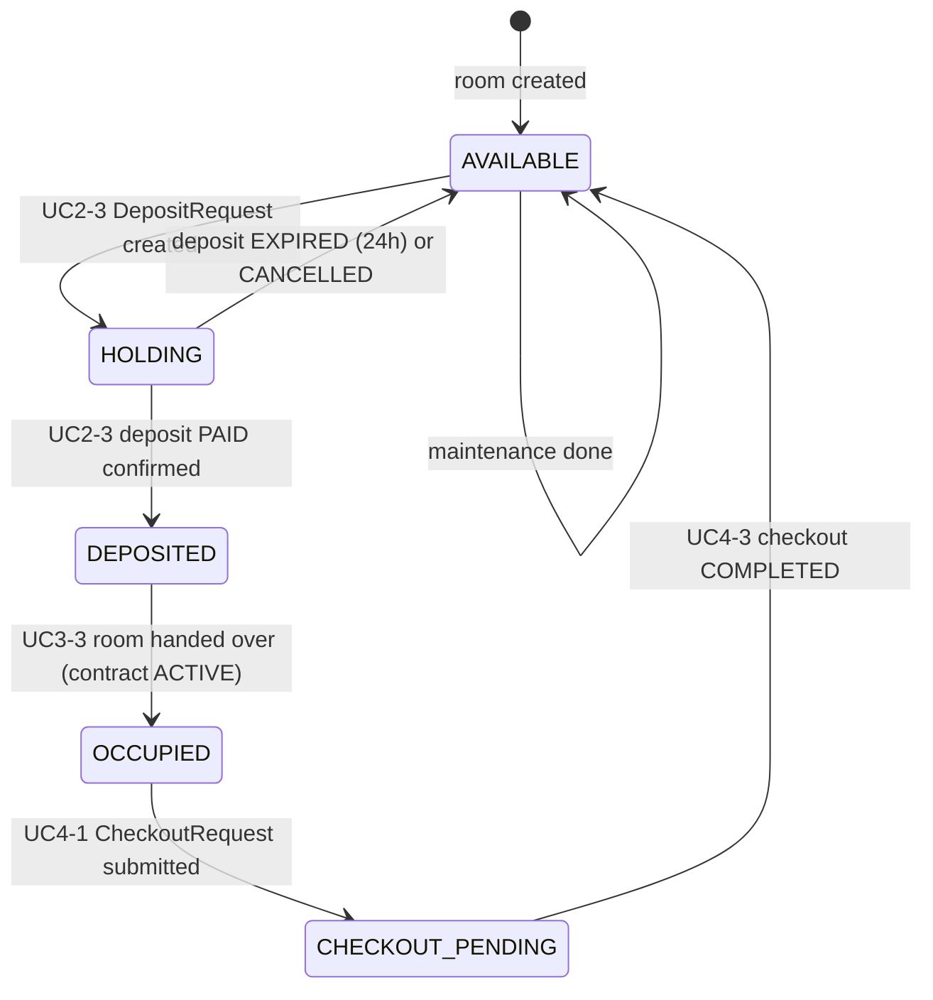
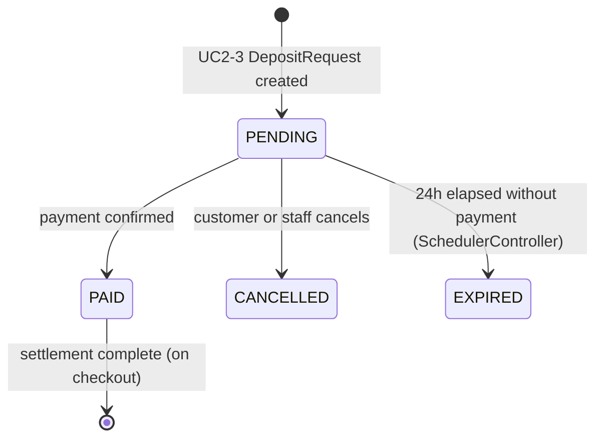
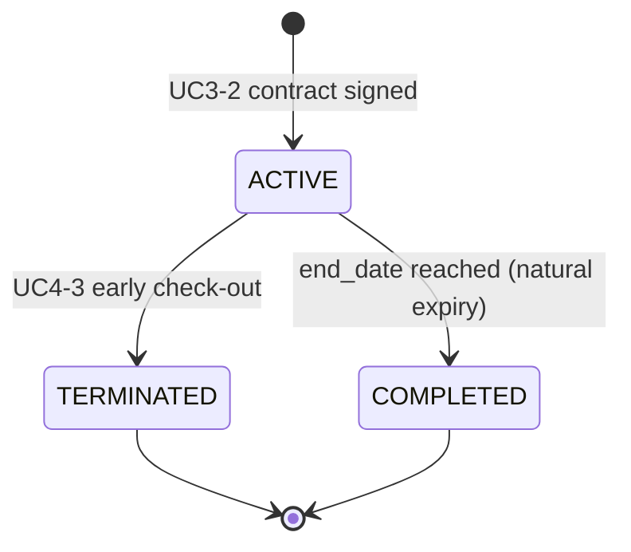
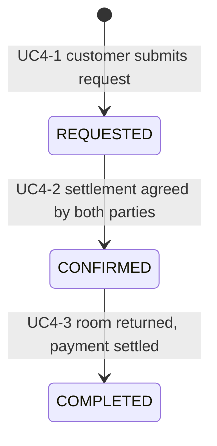

# State Machines

> Enum values match the course spec (BCE analysis model).

---

## Room Status

| Status | Meaning |
| --- | --- |
| `AVAILABLE` | Empty, can be booked |
| `HOLDING` | DepositRequest created — 24h window to pay |
| `DEPOSITED` | Deposit confirmed, awaiting check-in |
| `OCCUPIED` | Contract active, tenant in room |
| `CHECKOUT_PENDING` | Checkout request submitted, pending settlement |

---

## Deposit Status

| Status | Meaning |
| --- | --- |
| `PENDING` | Awaiting payment (24h window) |
| `PAID` | Payment received and confirmed |
| `CANCELLED` | Manually cancelled |
| `EXPIRED` | Auto-expired by SchedulerController after 24h |

**Refund Rules (applied on Settlement):**

| Condition | Refund % |
| --- | --- |
| PAID, no contract (CANCELLED) | 80% |
| Contract ACTIVE, stayed < 6 months | 50% |
| Contract ACTIVE, stayed >= 6 months | 70% |
| Contract COMPLETED (natural expiry) | 100% |
| Deductions | Unpaid rent, utilities, damages, penalties |

---

## Contract Status

| Status | Meaning |
| --- | --- |
| `ACTIVE` | Signed contract, tenant in residence |
| `TERMINATED` | Early exit before contract end_date |
| `COMPLETED` | Natural end of rental period |

---

## Checkout Status

| Status | Meaning |
| --- | --- |
| `REQUESTED` | Customer submitted check-out request |
| `CONFIRMED` | Settlement amount agreed |
| `COMPLETED` | Room handed back, deposit settled |
